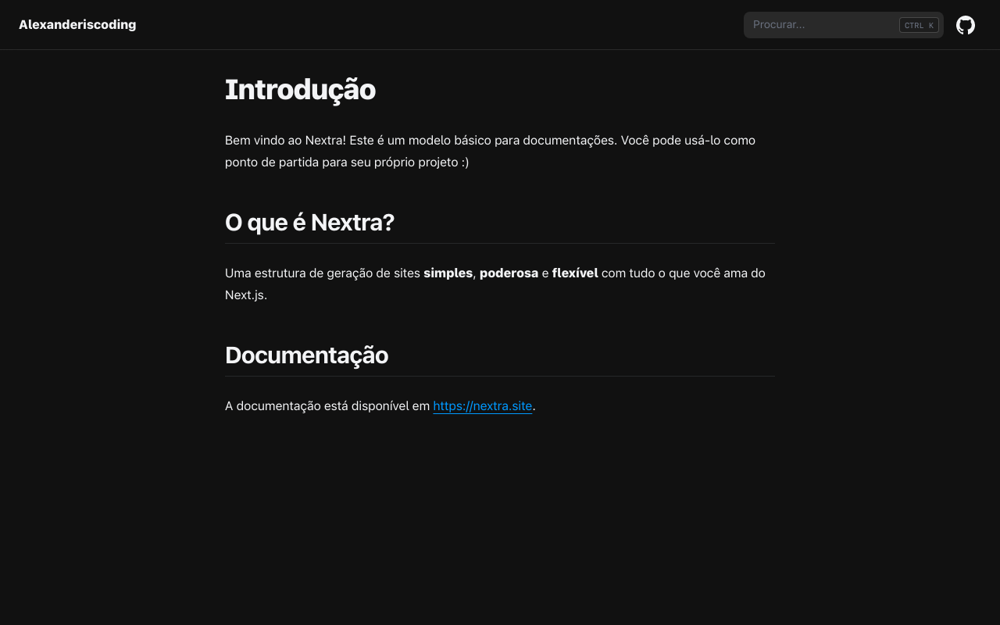

# Nextra Docs Template

Este é um site para documentações criado com [Nextra](https://nextra.site).

[**Acessar Site →**](https://alexanderiscoding.com)

## Desenvolvimento local

Primeiro, execute `pnpm i` para instalar as dependências.

Em seguida, execute `pnpm dev` para iniciar o servidor de desenvolvimento e acesse localhost:3000.

> Para começar com esse site como template, use a branch template.

## Licença

Este projeto está licenciado sob a licença MIT.
